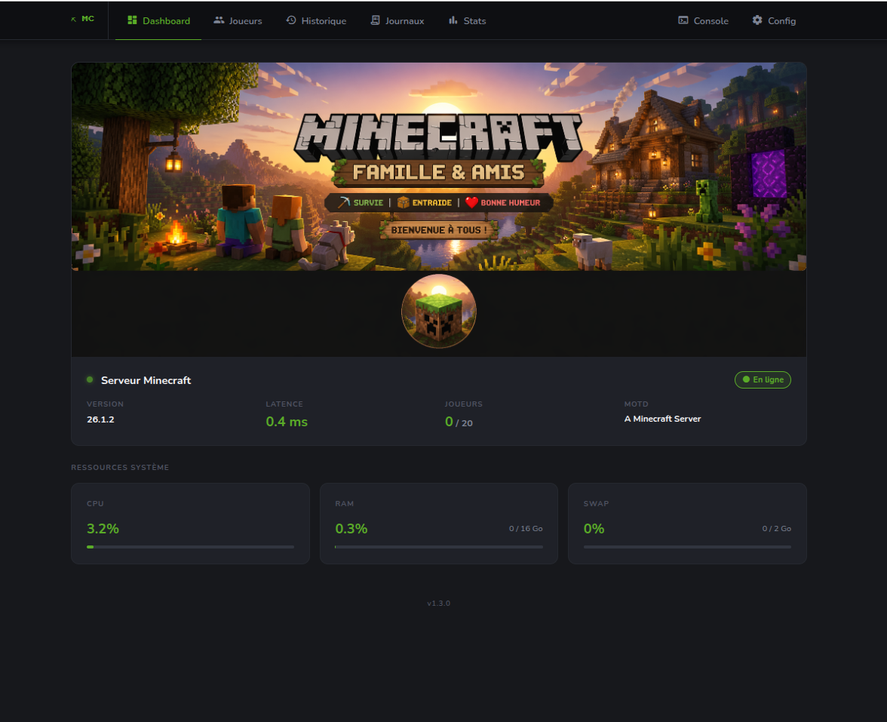
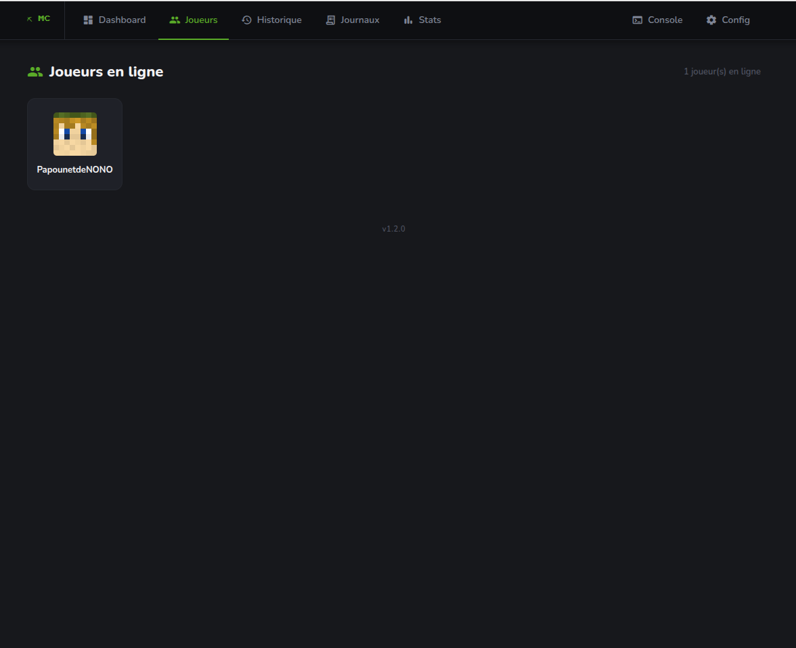
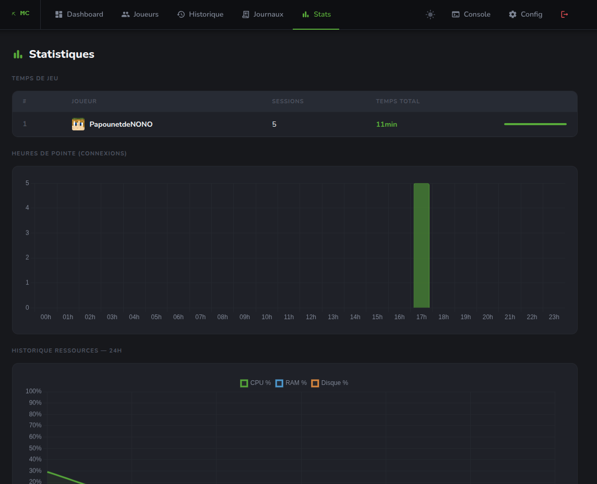
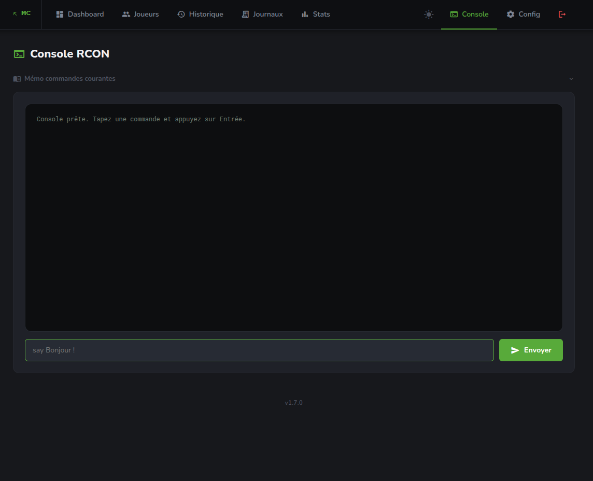

# Minecraft WebUI

Dashboard de monitoring pour serveur Minecraft Java Edition, avec notifications Discord et console RCON.


## Aperçu

| Dashboard | Joueurs |
|---|---|
|  |  |

| Statistiques | Console RCON |
|---|---|
|  |  |

## Fonctionnalités

- **Dashboard** — statut serveur, latence, joueurs en ligne, uptime serveur/VM, ressources système (CPU/RAM/Swap/Disque + réseau KB/s) en temps réel via SSE
- **Joueurs** — liste des connectés avec skins Minecraft ; clic sur un joueur → modal UUID, type de skin, cape ; **Kick / Ban** admin (RCON)
- **Historique** — journal des connexions/déconnexions persisté en SQLite (filtres 24h / 7j / 30j)
- **Statistiques** — temps de jeu par joueur, heures de pointe, historique CPU/RAM/Disque + réseau/disque I/O 24h (Chart.js)
- **Journaux** — 100 dernières lignes du log serveur avec coloration par niveau et filtre en temps réel
- **Notifications Discord** — embed avec skin du joueur envoyé à chaque connexion/déconnexion
- **Console RCON** — terminal interactif avec mémo des commandes courantes (admin)
- **Apparence** — bannière serveur et favicon personnalisables depuis l'interface (upload admin)
- **Thème** — bascule dark / light persistée dans le navigateur (localStorage)
- **Config UI** — webhook Discord et paramètres RCON modifiables depuis l'interface, protégés par mot de passe
- **Versioning** — version affichée dans le footer (fichier `web/VERSION`)

## Stack

| Service | Rôle |
|---|---|
| `web` | FastAPI + Jinja2 + Uvicorn |
| `discord-notifier` | Polling async + webhooks Discord |
| `caddy` | Reverse proxy HTTPS |

## Prérequis

- Docker + Docker Compose
- Serveur Minecraft Java avec `enable-status=true` dans `server.properties`

> **Note** : la page Journaux et la détection d'uptime serveur nécessitent que le fichier `latest.log` du serveur Minecraft soit accessible localement sur la machine qui héberge Docker (paramètre `MC_LOG_PATH`). Dans le cas d'un serveur distant, un montage réseau (NFS, sshfs…) peut suffire.

## Installation

```bash
git clone https://github.com/picardflo/minecraft_webui.git
cd minecraft_webui

cp .env.example .env
nano .env

docker compose up -d --build
```

## Configuration (.env)

```env
MC_HOST=your.minecraft.server.com   # Adresse du serveur Minecraft
MC_PORT=25565                        # Port Java (défaut 25565)
MC_LOG_PATH=/srv/minecraft/server/logs/latest.log

ADMIN_PASSWORD=changeme              # Mot de passe pour /settings et /console
SECRET_KEY=change-this-to-a-long-random-string

DOMAIN=localhost                     # Domaine utilisé par Caddy
```

## SSL / TLS

Trois modes disponibles, sélectionnés via `CADDYFILE` dans `.env` :

### Mode 1 — Self-signed (défaut, LAN/local)

Aucune configuration supplémentaire. Caddy génère un certificat local automatiquement.

```env
DOMAIN=mc.home.lan
# CADDYFILE non défini → utilise Caddyfile (tls internal)
```

> Le navigateur affichera un avertissement de sécurité la première fois.

### Mode 2 — Let's Encrypt (domaine public)

Ports 80 et 443 doivent être ouverts et le domaine doit pointer vers votre IP.

```env
DOMAIN=mc.example.com
CADDYFILE=Caddyfile.letsencrypt
TLS_EMAIL=admin@example.com
```

### Mode 3 — Certificat existant (wildcard, entreprise…)

Déposer `fullchain.pem` et `privkey.pem` dans le dossier `./certs/`.

```env
DOMAIN=mc.home.lan
CADDYFILE=Caddyfile.custom
```

## Console RCON (optionnel)

Activer dans `server.properties` :

```properties
enable-rcon=true
rcon.port=25575
rcon.password=VotreMotDePasse
```

Puis renseigner les paramètres dans l'interface `/settings`.

## Métriques système

Les ressources CPU/RAM sont lues depuis `/proc` de la machine hôte (bind-mount). Les graphiques historiques sont enregistrés toutes les 5 minutes en SQLite.

## Mise à jour

```bash
git pull && docker compose up -d --build web
```

## Changelog

### v1.8.0
- **Feat** : PWA (Progressive Web App) — installation sur mobile (Android/iOS), icône Minecraft pixel art, service worker sans cache (données temps réel)

### v1.7.0
- **Feat** : bouton Discord sur le dashboard — logo SVG officiel blurple, lien configurable dans `/settings`, visible uniquement si renseigné

### v1.6.2
- **Fix** : stats temps de jeu — session en cours comptabilisée (join sans leave)
- **Fix** : purge historique réinitialise `_live_players` → re-log automatique des joueurs connectés en < 30s

### v1.6.1
- **UI** : bouton Déconnexion dans la navbar (visible uniquement quand connecté en admin)
- **UI** : page `/settings` en 2 colonnes (config à gauche, maintenance à droite)

### v1.6.0
- **Feat** : section Maintenance dans `/settings` — purge historique connexions (> 30j / 90j / tout), purge métriques charts, VACUUM SQLite avec affichage taille DB

### v1.5.1
- **Fix** : uptime machine affiché dans Ressources système — algorithme générique `CLOCK_BOOTTIME − starttime(PID 1)`, fiable sur LXC Proxmox, VM KVM et bare-metal
- **Fix** : charts Réseau I/O et Disque I/O toujours plats — race condition entre le flux SSE (fenêtre 5 s) et le recorder (fenêtre 5 min) sur les globals `_prev_*` ; chaque appelant dispose désormais de son propre état

### v1.5.0
- Métriques système étendues : disque, réseau KB/s, disque I/O KB/s, uptime VM
- Nouveaux charts 24 h : CPU/RAM/Disque %, Réseau I/O, Disque I/O
- `SRV_PATH` configurable dans `.env` pour le monitoring disque

### v1.4.0
- Thème dark / light persisté (localStorage) avec bascule dans la nav
- Bannière serveur et favicon personnalisables depuis l'interface (upload admin)
- Uptime serveur Minecraft affiché dans la carte statut (lu depuis `latest.log` + SQLite)

### v1.3.0
- Page Statistiques : temps de jeu par joueur, heures de pointe, historique graphique (Chart.js)

### v1.2.0
- Modal joueur : UUID, type de skin (Steve/Alex), cape — données Mojang proxiées côté serveur
- Kick / Ban depuis l'interface (admin, RCON)

### v1.1.0
- Mémo des commandes courantes dans la console RCON
- Remplacement de `mcrcon` par une implémentation RCON async native (fix `signal only works in main thread`)
- Versioning applicatif (`web/VERSION` affiché dans le footer)

## Roadmap

- [ ] Favicon automatique depuis l'icône du serveur Minecraft (status broadcast)
- ~~Gestion de la ban-list depuis l'interface (RCON)~~
- [ ] Support multi-serveurs
- [x] Mode PWA (Progressive Web App) — installation sur mobile
- [ ] Notifications push navigateur (connexion/déconnexion joueurs)

## Contribution

Les contributions sont les bienvenues ! Pour proposer une amélioration :

1. Fork le dépôt
2. Crée une branche (`git checkout -b feature/ma-feature`)
3. Commit tes modifications (`git commit -m 'feat: ...'`)
4. Push (`git push origin feature/ma-feature`)
5. Ouvre une Pull Request

Pour les bugs, ouvre une issue en décrivant les étapes de reproduction.

## Licence

MIT — voir [LICENSE](LICENSE).

