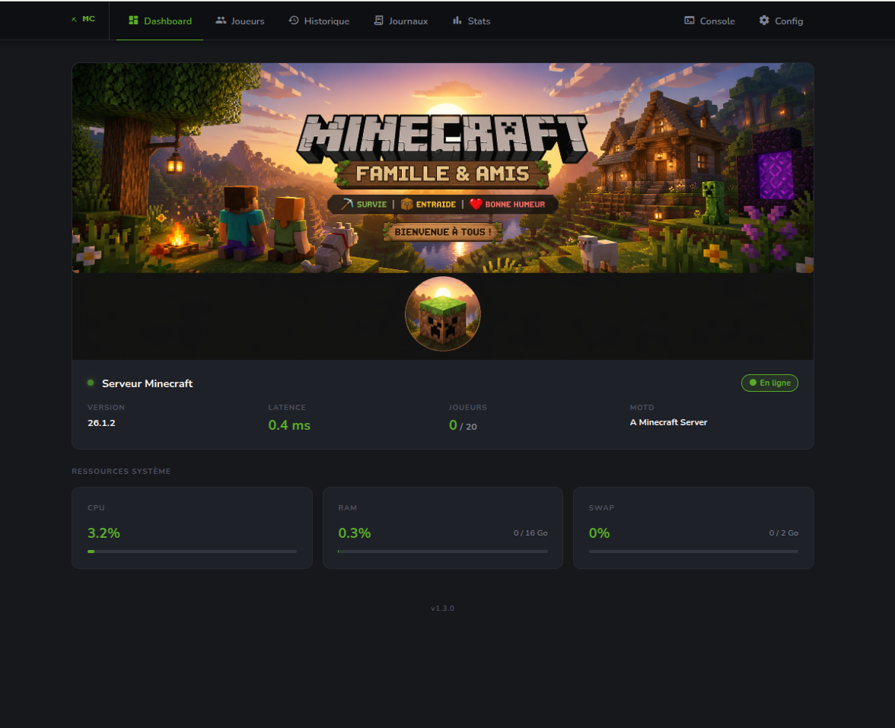
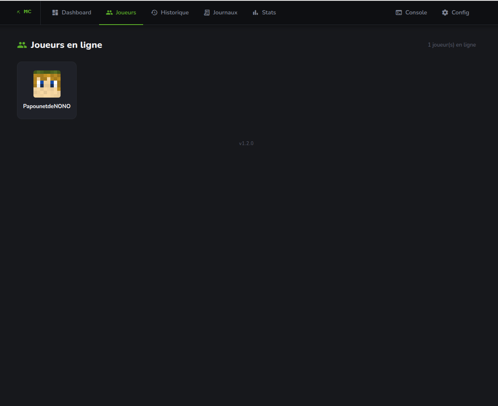
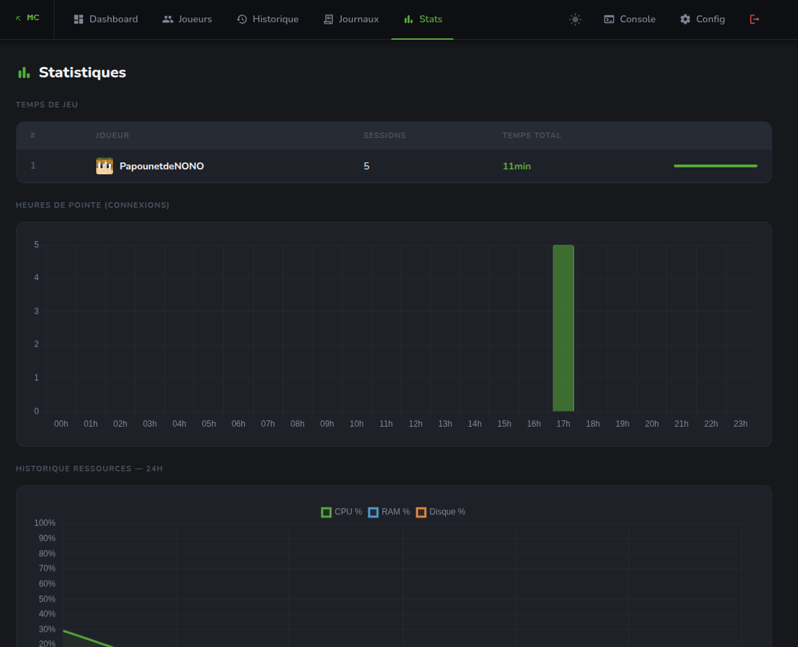
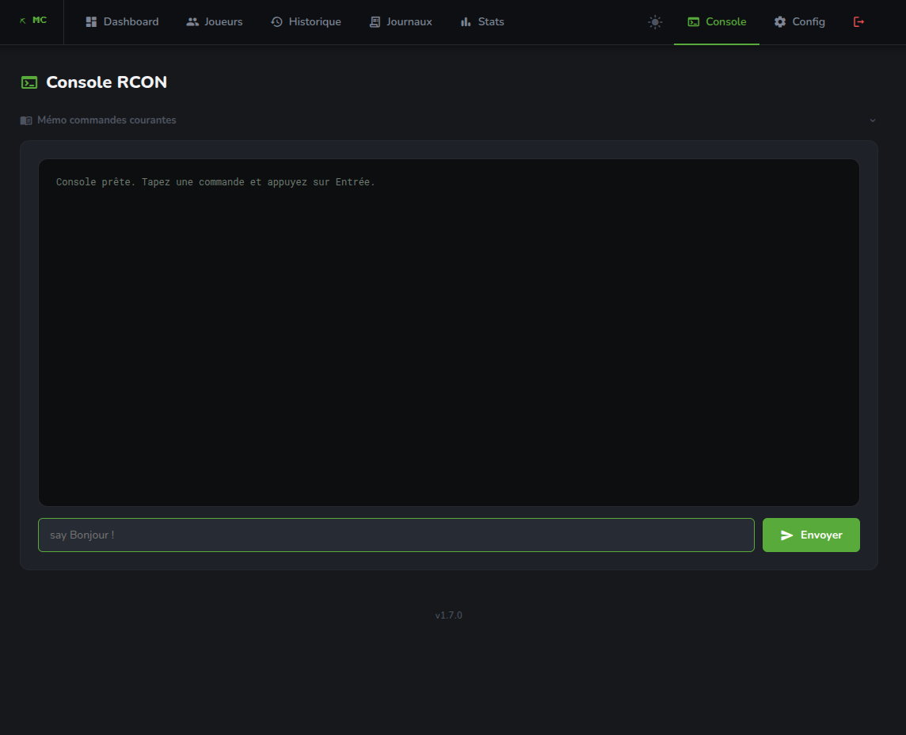

# Minecraft WebUI

Monitoring dashboard for Minecraft Java Edition servers, with Discord notifications and RCON console.

> 🇫🇷 [Version française](README.fr.md)


## Screenshots

| Dashboard | Players |
|---|---|
|  |  |

| Statistics | RCON Console |
|---|---|
|  |  |

## Features

- **Dashboard** — server status, latency, online players, server/VM uptime, system resources (CPU/RAM/Swap/Disk + network KB/s) in real time via SSE
- **Players** — connected players list with Minecraft skins; click a player → modal with UUID, skin type, cape; **Kick / Ban** (admin, RCON)
- **History** — connection/disconnection log persisted in SQLite (filters: 24h / 7d / 30d)
- **Statistics** — playtime per player, peak hours, CPU/RAM/Disk + network/disk I/O history 24h (Chart.js)
- **Logs** — last 100 lines of the server log with level coloring and real-time filter
- **Discord notifications** — embed with player skin sent on each join/leave
- **RCON console** — interactive terminal with a quick-reference command cheatsheet (admin)
- **Appearance** — server banner and favicon customizable from the UI (admin upload)
- **Theme** — dark / light toggle persisted in the browser (localStorage)
- **Config UI** — Discord webhook and RCON settings editable from the interface, password-protected
- **Push notifications** — browser push notifications (Web Push / VAPID) on player join/leave (Android, iOS 16.4+, desktop)
- **PWA** — installable as a Progressive Web App on mobile (Android/iOS)
- **Versioning** — version displayed in the footer (`web/VERSION`)

## Stack

| Service | Role |
|---|---|
| `web` | FastAPI + Jinja2 + Uvicorn |
| `discord-notifier` | Async polling + Discord webhooks |
| `caddy` | HTTPS reverse proxy |

## Requirements

- Docker + Docker Compose
- Minecraft Java server with `enable-status=true` in `server.properties`

> **Note**: the Logs page and server uptime detection require the Minecraft `logs` directory to be accessible locally on the Docker host (via the `MC_LOG_DIR` setting). The whole directory is mounted — not the single `latest.log` file — because mounting a single file freezes the view on each log rotation. For a remote server, a network mount (NFS, sshfs…) is sufficient.

## Installation

```bash
git clone https://github.com/picardflo/minecraft_webui.git
cd minecraft_webui

cp .env.example .env
nano .env

docker compose up -d --build
```

## Configuration (.env)

```env
MC_HOST=your.minecraft.server.com   # Minecraft server address
MC_PORT=25565                        # Java port (default 25565)
MC_LOG_DIR=/srv/minecraft/server/logs      # server logs dir (not the file alone)

ADMIN_PASSWORD=changeme              # Password for /settings and /console
SECRET_KEY=change-this-to-a-long-random-string

DOMAIN=localhost                     # Domain used by Caddy
```

## SSL / TLS

Three modes available, selected via `CADDYFILE` in `.env`:

### Mode 1 — Self-signed (default, LAN/local)

No extra configuration. Caddy generates a local certificate automatically.

```env
DOMAIN=mc.home.lan
# CADDYFILE not set → uses Caddyfile (tls internal)
```

> The browser will show a security warning the first time.

### Mode 2 — Let's Encrypt (public domain)

Ports 80 and 443 must be open and the domain must point to your IP.

```env
DOMAIN=mc.example.com
CADDYFILE=Caddyfile.letsencrypt
TLS_EMAIL=admin@example.com
```

### Mode 3 — Existing certificate (wildcard, corporate…)

Place `fullchain.pem` and `privkey.pem` in the `./certs/` folder.

```env
DOMAIN=mc.home.lan
CADDYFILE=Caddyfile.custom
```

## RCON Console (optional)

Enable in `server.properties`:

```properties
enable-rcon=true
rcon.port=25575
rcon.password=YourPassword
```

Then fill in the parameters in the `/settings` interface.

## System Metrics

CPU/RAM resources are read from the host's `/proc` (bind-mount). Historical graphs are recorded every 5 minutes in SQLite.

## Monitoring / API Health

The `/api/health` endpoint exposes Minecraft server status in JSON:

```json
{
  "status": "ok",
  "minecraft": {
    "online": true,
    "players": 3,
    "players_max": 20,
    "latency_ms": 0.3,
    "uptime_seconds": 86400,
    "version": "1.21.4",
    "motd": "A Minecraft Server"
  },
  "webui_version": "1.10.4"
}
```

- HTTP `200` when online, `503` when offline — **the JSON body is identical in both cases**, only `minecraft.online` changes
- Compatible with **Zabbix HTTP Agent**, **Uptime Kuma**, **Grafana**, `curl`…

> ⚠️ **If you poll this endpoint, accept the 503.** A monitor that only expects
> `200` treats the "offline" answer as a transport error: it stores no value, its
> metrics freeze on the last known one, and the "server down" alert never fires.
> In Zabbix the field is *Required status codes* → `200,503`; the bundled template
> declares it.
- A ready-to-import **Zabbix 7.0 template** is available in [`docs/zabbix/zbx_minecraft_webui.yaml`](docs/zabbix/zbx_minecraft_webui.yaml) (8 items, 3 triggers)
- A **Homepage widget** config is available in [`docs/homepage/services.yaml`](docs/homepage/services.yaml)

## Update

```bash
git pull && docker compose up -d --build
```

> Rebuild **all** services, not just `web`. Some releases change
> `docker-compose.yml` itself (v1.10.3 added `TZ` to the three services):
> narrowing the command to `web` leaves the others on their old definition.

## Changelog

### v1.10.4
- **Fix**: the dashboard memory gauge showed the `web` container's own memory
  (~51 MiB, i.e. "0 / 16 GB") instead of the machine's (8.7 GiB of 16). Under a
  Proxmox LXC, `lxcfs` answers `/proc/meminfo` **according to the cgroup of the
  process doing the reading**: the Docker container sits in a nested cgroup, so it
  got its own consumption back. Mounting the host's `/proc` changed nothing — what
  matters is the identity of the reader, not the path of the file.

  Memory is now read from two sources and the larger of the two is kept, the only
  known failure mode being under-estimation: `psutil`, and the host root cgroup
  (`memory.current` minus the reclaimable file cache, cgroup v1 supported),
  mounted read-only as `/host/cgroup` by `docker-compose.yml`. This holds for the
  three deployments: on **bare metal** and in a **KVM VM** `/proc/meminfo` already
  describes the whole machine and the root cgroup exposes no `memory.current`, so
  `psutil` is used; in an **LXC** the root cgroup is the container's own and
  supplies the right figure. The total always comes from `psutil`, which is
  accurate everywhere. The `psutil` reading now uses `MemAvailable` rather than
  `used`.

  **After deploying**, run `docker compose up -d --build` (and not just the `web`
  service): this version changes `docker-compose.yml` itself.

### v1.10.3
- **Fix**: negative `uptime_seconds` on any host not running in UTC.
  `_server_start_from_log()` labelled as `timezone.utc` a time that Minecraft
  writes to `latest.log` in **local time**: the start instant ended up shifted by
  the local offset (−2 h in CEST), and the UI displayed "Online for −6865 s". The
  time is now interpreted as local via `astimezone()`. The bug stayed hidden as
  long as the host ran in UTC.
- **Fix**: `TZ` declared for all three services in `docker-compose.yml` and
  documented in `.env.example` — the container must share the timezone of the
  machine writing the log. `tzdata` added to `web/Dockerfile`, without which `TZ`
  has no effect on `python:3.12-slim`.

  **After deploying**, restart the Minecraft server (`systemctl restart
  minecraft`): the wrong value is persisted in the database and is only
  recomputed when the server goes offline then back online.

### v1.10.2
- **Fix**: Zabbix template — the `Minecraft WebUI - Health (raw)` item only accepted HTTP `200`. Since `/api/health` answers `503` when the server is offline, Zabbix rejected the response, the item turned *unsupported*, and its dependent items froze on their last value. As a result `minecraft.server.online` stayed stuck at `1` and the **"Minecraft server is DOWN" trigger had never been able to fire since its creation** — verified on 12 September 2026 against a real three-minute outage that produced no alert. The template now declares `status_codes: '200,503'`.

  **Apply it to an already-imported instance too**: re-importing does not update an existing linked item — fix the *Required status codes* field on the item itself.

### v1.10.1
- **Fix**: Logs page froze after a server restart / log rotation — the Docker volume mounted the single `latest.log` file, so the container stayed pinned to the old inode once Minecraft recreated the file. Now mounts the whole `logs` directory (`MC_LOG_DIR`).

### v1.10.0
- **Feat**: `/api/health` endpoint — Minecraft server status, player count, latency, uptime, version, MOTD; HTTP 200 (online) or 503 (offline); compatible with Zabbix HTTP Agent, Uptime Kuma, Grafana, etc.

### v1.9.0
- **Feat**: browser push notifications — bell in the navbar, Web Push subscription (VAPID), join/leave notifications (Android, iOS 16.4+, desktop)

### v1.8.0
- **Feat**: PWA (Progressive Web App) — installable on mobile (Android/iOS), Minecraft pixel art icon, cache-free service worker (real-time data)

### v1.7.0
- **Feat**: Discord button on dashboard — official blurple SVG logo, configurable link in `/settings`, only shown when set

### v1.6.2
- **Fix**: playtime stats — ongoing session counted (join without leave)
- **Fix**: history purge resets `_live_players` → automatic re-log of connected players within 30s

### v1.6.1
- **UI**: logout button in navbar (visible only when logged in as admin)
- **UI**: `/settings` page in 2 columns (config left, maintenance right)

### v1.6.0
- **Feat**: Maintenance section in `/settings` — purge connection history (> 30d / 90d / all), purge chart metrics, SQLite VACUUM with DB size display

### v1.5.1
- **Fix**: machine uptime in System Resources — generic algorithm `CLOCK_BOOTTIME − starttime(PID 1)`, reliable on LXC Proxmox, KVM VM and bare-metal
- **Fix**: Network I/O and Disk I/O charts always flat — race condition between SSE stream (5s window) and recorder (5min window) on shared `_prev_*` globals; each caller now has its own state

### v1.5.0
- Extended system metrics: disk, network KB/s, disk I/O KB/s, VM uptime
- New 24h charts: CPU/RAM/Disk %, Network I/O, Disk I/O
- `SRV_PATH` configurable in `.env` for disk monitoring

### v1.4.0
- Dark / light theme persisted (localStorage) with nav toggle
- Server banner and favicon customizable from the UI (admin upload)
- Minecraft server uptime displayed in the status card (read from `latest.log` + SQLite)

### v1.3.0
- Statistics page: playtime per player, peak hours, historical charts (Chart.js)

### v1.2.0
- Player modal: UUID, skin type (Steve/Alex), cape — Mojang data proxied server-side
- Kick / Ban from the UI (admin, RCON)

### v1.1.0
- RCON command cheatsheet
- Replaced `mcrcon` with a native async RCON implementation (fix `signal only works in main thread`)
- App versioning (`web/VERSION` displayed in footer)

## Roadmap

- ~~Auto favicon from Minecraft server icon (status broadcast)~~
- ~~Ban-list management from the UI (RCON)~~
- ~~Multi-server support~~
- [x] PWA (Progressive Web App) — installable on mobile
- [x] Browser push notifications (player join/leave)

## Contributing

Contributions are welcome! To propose an improvement:

1. Fork the repository
2. Create a branch (`git checkout -b feature/my-feature`)
3. Commit your changes (`git commit -m 'feat: ...'`)
4. Push (`git push origin feature/my-feature`)
5. Open a Pull Request

For bugs, open an issue describing the reproduction steps.

## License

MIT — see [LICENSE](LICENSE).
